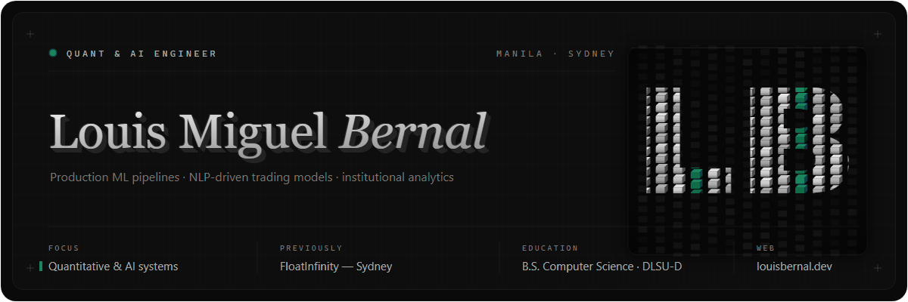
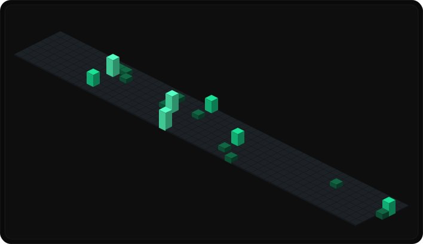

  <a href="https://ph.linkedin.com/in/louisbernal"><samp>LINKEDIN</samp></a>
  &nbsp;&nbsp;·&nbsp;&nbsp;
  <a href="https://x.com/DataMigzz"><samp>X / TWITTER</samp></a>
  &nbsp;&nbsp;·&nbsp;&nbsp;
  <a href="https://github.com/LouisMiguelBernal?tab=repositories"><samp>REPOSITORIES</samp></a>

 

#### <samp>PROFILE</samp>

Data engineer working across production machine learning, NLP-driven trading models, and institutional analytics. Previously at FloatInfinity (Sydney), and a Computer Science student specializing in Intelligent Systems at De La Salle University — Dasmariñas.

I build systems that are transparent, validated, and made to survive contact with real data — walk-forward-tested models, leak-free pipelines, and dashboards that answer questions rather than decorate them.

 

#### <samp>SELECTED WORK</samp>

| Project | Domain | Summary |
|:--|:--|:--|
| **[DeepS&P](https://github.com/LouisMiguelBernal/DeepSP)** · [live](https://deepsp500.streamlit.app/) | Deep learning · Quant finance | Three-layer LSTM trained on 90+ years of S&P 500 data, with Monte Carlo simulation of up to 2,000 stochastic price paths. |
| **[QuantMaven](https://github.com/LouisMiguelBernal/QuantMaven)** · [live](https://quantmaven.streamlit.app/) | Market research platform | Research platform for stocks, forex, and crypto — fundamentals, candlestick charting, technical indicators, and algorithmic insights. |
| **[VisorAI](https://github.com/LouisMiguelBernal/VisorAI)** | Computer vision · Mobile | YOLOv11 mobile app detecting LTO road markings in real time, with auditory driver feedback. mAP@0.5 of 0.87 at ~120 ms per frame. |
| **[GiftxAI](https://github.com/LouisMiguelBernal/GiftxAI)** · [live](https://giftxai.streamlit.app/) | LLM · RAG | Retrieval-augmented recommender — FAISS vector store, a triple-validation grounding chain, and a Groq Llama 3.3 backbone. |
| **[XGE](https://github.com/LouisMiguelBernal/XGE)** · [live](https://xge-ai.streamlit.app/) | ML · Explainability | End-to-end XGBoost pipeline predicting vehicle CO2 emissions, with SHAP explainability and an interactive dashboard. |
| **[Signa](https://github.com/LouisMiguelBernal/Signa)** | Computer vision | Real-time traffic-sign detection from live camera input — detect, classify, and alert while driving. |

 

#### <samp>CONTRIBUTIONS</samp>

 

#### <samp>STACK</samp>

| Area | Tools |
|:--|:--|
| **AI / Machine Learning** | PyTorch · TensorFlow · Scikit-learn · LangChain · Ollama · OpenCV · Hugging Face · FAISS · Groq |
| **Modeling & methods** | LSTM · XGBoost · LightGBM · CatBoost · K-Means · PCA · t-SNE · UMAP · Monte Carlo |
| **Data & Backend** | Python · SQL · FastAPI · PostgreSQL · MongoDB · Redis · Pandas · NumPy · Azure ETL |
| **Analytics & Viz** | Power BI · Tableau · Plotly · Matplotlib · Seaborn · Excel |
| **Frontend** | React · Next.js · TypeScript · Tailwind CSS · Framer Motion · React Native |
| **DevOps & Tooling** | Git · GitHub · Docker · Vercel · MLflow · Jupyter · Streamlit |

 

#### <samp>CERTIFICATIONS</samp>

| Certification | Issuer | Credential |
|:--|:--|:--|
| **Deep Learning Specialization** | DeepLearning.AI · 2025 | [verify](https://coursera.org/verify/5DCEBTE0WLYU) |
| Neural Networks and Deep Learning | DeepLearning.AI | [verify](https://coursera.org/verify/3520567IBKAP) |
| Improving Deep Neural Networks | DeepLearning.AI | — |
| Structuring Machine Learning Projects | DeepLearning.AI | [verify](https://coursera.org/verify/PW7B3FJBJ8L5) |
| Convolutional Neural Networks | DeepLearning.AI | [verify](https://coursera.org/verify/VOPC3983POHV) |
| Sequence Models | DeepLearning.AI | [verify](https://coursera.org/verify/AGSTIN6MFW6H) |

 

#### <samp>SELECTED ARCHIVE</samp>

| Machine learning | Analytics & BI | Markets & NLP |
|:--|:--|:--|
| [Census Income](https://github.com/LouisMiguelBernal/Census-Income) | [House Prices — Power BI + PostgreSQL](https://github.com/LouisMiguelBernal/House-Price-Analysis-Dashboard-with-Power-BI-and-PostgreSQL) | [BTC vs. Economic Indicators](https://github.com/LouisMiguelBernal/BTC-Econimic-Indicators) |
| [Customer Churn](https://github.com/LouisMiguelBernal/Customer-Churn-ML) | [FDIC Failed Banks](https://github.com/LouisMiguelBernal/FDIC-Failed-Banks-Analysis) | [Economic Indicators Forecast](https://github.com/LouisMiguelBernal/Economic-Indicators-Stock-Forecast) |
| [Medical Insurance](https://github.com/LouisMiguelBernal/Medical-Insurance-ML) | [AirBNB](https://github.com/LouisMiguelBernal/AirBNB) | [Google Stock Analysis](https://github.com/LouisMiguelBernal/Google-Stock-Analysis) |
| [California Housing](https://github.com/LouisMiguelBernal/California-Housing-Prediction) | [Starbucks Locations](https://github.com/LouisMiguelBernal/Starbucks-Location-Analysis) | [Top 3 Stock Indexes](https://github.com/LouisMiguelBernal/Top-3-Stock-Indexes-Analysis) |
| [Car Price Prediction](https://github.com/LouisMiguelBernal/Car-Price-Prediction) | [Data Breaches](https://github.com/LouisMiguelBernal/Data-Breach-Analysis) | [Twitter Sentiment](https://github.com/LouisMiguelBernal/Twitter-Sentiment-Analysis) |
| [Face Recognition — SVM](https://github.com/LouisMiguelBernal/Face-Recognition-SVM) | [Global EV Adoption](https://github.com/LouisMiguelBernal/Global-Electric-Vehicle-PostgreSQL-Python-Analysis) | [NLP Emotion](https://github.com/LouisMiguelBernal/NLP-Project) |

 

#### <samp>BACKGROUND</samp>

- **FloatInfinity — Sydney** · Data Engineer (previous). NLP-based multi-factor models and Azure ETL pipelines with real-time API ingestion.
- **De La Salle University — Dasmariñas** · B.S. Computer Science, Intelligent Systems.

 

---

<samp>LOUIS MIGUEL BERNAL &nbsp;·&nbsp; MANILA / SYDNEY &nbsp;·&nbsp; MMXXVI</samp>

